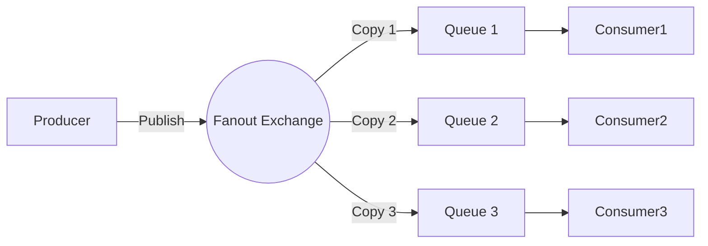

# Fanout 交换机（ブロードキャスト型交換機）

## 1. 基本概念
- **Fanout Exchange** 是一种消息路由机制，**不处理路由键（Routing Key）**，直接将消息**广播**到所有绑定的队列。
- 类似于网络中的广播（Broadcast），所有订阅者（队列）都会收到相同的消息。

## 2. 核心特点
- ✅ **无视 Routing Key**：绑定队列时无需指定路由键（即使指定也会被忽略）。
- ✅ **全量广播**：消息会被发送到**所有绑定到该交换机的队列**。
- ✅ **解耦性强**：生产者和消费者无需知道彼此的存在。

## 3. 使用场景
- **日志系统**：将日志消息广播到多个存储或分析服务。
- **实时通知**：例如群发新闻、公告等。
- **事件驱动架构**：多个微服务需要响应同一事件时（如订单创建）。

## 4. 工作原理图解

## 5. 生产者代码
public class FanoutProducer {
    private static final String EXCHANGE_NAME = "fanout_orders";

    public static void main(String[] args) throws Exception {
        ConnectionFactory factory = new ConnectionFactory();
        factory.setHost("localhost");

        try (Connection connection = factory.newConnection();
             Channel channel = connection.createChannel()) {
            
            // 声明fanout类型交换机
            channel.exchangeDeclare(EXCHANGE_NAME, BuiltinExchangeType.FANOUT);

            // 发送广播消息（routingKey可为任意值）
            String message = "Order#123 Created";
            channel.basicPublish(EXCHANGE_NAME, "unused_key", null, 
                message.getBytes(StandardCharsets.UTF_8));
            
            System.out.println(" [x] Sent: '" + message + "'");
        }
    }
}

## 6. 消费者代码
public class FanoutConsumer {
    private static final String EXCHANGE_NAME = "fanout_orders";

    public static void main(String[] args) throws Exception {
        ConnectionFactory factory = new ConnectionFactory();
        factory.setHost("localhost");

        Connection connection = factory.newConnection();
        Channel channel = connection.createChannel();

        // 声明交换机
        channel.exchangeDeclare(EXCHANGE_NAME, BuiltinExchangeType.FANOUT);
        
        // 创建临时队列（非持久化、独占、自动删除）
        String queueName = channel.queueDeclare().getQueue();
        
        // 绑定队列到交换机（routingKey被忽略）
        channel.queueBind(queueName, EXCHANGE_NAME, "");

        System.out.println(" [*] Waiting for messages...");

        DeliverCallback deliverCallback = (consumerTag, delivery) -> {
            String message = new String(delivery.getBody(), "UTF-8");
            System.out.println(" [x] Received '" + message + "'");
        };

        channel.basicConsume(queueName, true, deliverCallback, consumerTag -> {});
    }
}
