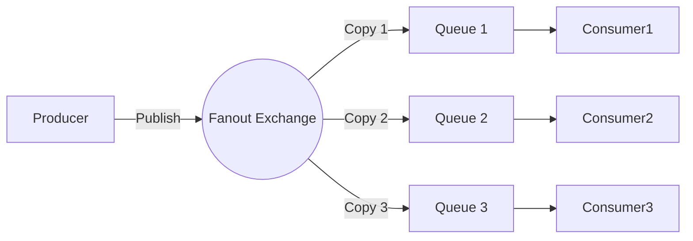

# Fanout エクスチェンジ（ブロードキャスト型交換機）

## 1. 基本概念
- **Fanout Exchange** はルーティングキーを処理せず、メッセージをすべてのバインドされたキューに**ブロードキャスト**するメッセージルーティング機構です。
- ネットワークのブロードキャストと同様に、すべてのサブスクライバー（キュー）が同じメッセージを受信します。

## 2. 主な特徴
- ✅ **ルーティングキー無視**：キューをバインドする際にルーティングキーを指定する必要がありません（指定しても無視されます）。
- ✅ **全ブロードキャスト**：メッセージは**当該エクスチェンジにバインドされたすべてのキュー**に送信されます。
- ✅ **高い疎結合性**：プロデューサーとコンシューマーは互いの存在を知る必要がありません。

## 3. 使用シナリオ
- **ログシステム**：ログメッセージを複数のストレージや分析サービスにブロードキャスト
- **リアルタイム通知**：ニュースや告知の一斉送信など
- **イベント駆動アーキテクチャ**：複数のマイクロサービスが同一イベント（例：注文作成）に対応する場合

## 4. 動作原理図

