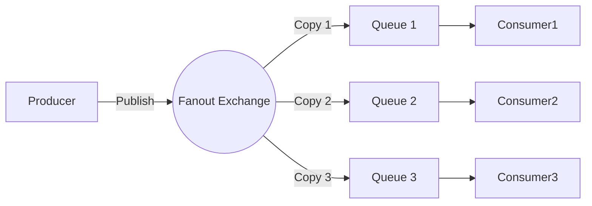

# Fanout エクスチェンジ（ブロードキャスト型交換機）

## 1. 基本概念
- **Fanout Exchange** はルーティングキーを処理せず、メッセージをすべてのバインドされたキューに**ブロードキャスト**するメッセージルーティング機構です。
- ネットワークのブロードキャストと同様に、すべてのサブスクライバー（キュー）が同じメッセージを受信します。

## 2. 主な特徴
- ✅ **ルーティングキー無視**：キューをバインドする際にルーティングキーを指定する必要がありません（指定しても無視されます）。
- ✅ **全ブロードキャスト**：メッセージは**当該エクスチェンジにバインドされたすべてのキュー**に送信されます。
- ✅ **高い疎結合性**：プロデューサーとコンシューマーは互いの存在を知る必要がありません。

## 3. 使用シナリオ
- **ログシステム**：ログメッセージを複数のストレージや分析サービスにブロードキャスト
- **リアルタイム通知**：ニュースや告知の一斉送信など
- **イベント駆動アーキテクチャ**：複数のマイクロサービスが同一イベント（例：注文作成）に対応する場合

## 4. 動作原理図

## 5. プロデューサーコード
public class FanoutProducer {
    private static final String EXCHANGE_NAME = "fanout_orders";

    public static void main(String[] args) throws Exception {
        ConnectionFactory factory = new ConnectionFactory();
        factory.setHost("localhost");

        try (Connection connection = factory.newConnection();
             Channel channel = connection.createChannel()) {
            
            // 声明fanout类型交换机
            channel.exchangeDeclare(EXCHANGE_NAME, BuiltinExchangeType.FANOUT);

            // 发送广播消息（routingKey可为任意值）
            String message = "Order#123 Created";
            channel.basicPublish(EXCHANGE_NAME, "unused_key", null, 
                message.getBytes(StandardCharsets.UTF_8));
            
            System.out.println(" [x] Sent: '" + message + "'");
        }
    }
}

## 6. コンシューマーコード
public class FanoutConsumer {
    private static final String EXCHANGE_NAME = "fanout_orders";

    public static void main(String[] args) throws Exception {
        ConnectionFactory factory = new ConnectionFactory();
        factory.setHost("localhost");

        Connection connection = factory.newConnection();
        Channel channel = connection.createChannel();

        // 声明交换机
        channel.exchangeDeclare(EXCHANGE_NAME, BuiltinExchangeType.FANOUT);
        
        // 创建临时队列（非持久化、独占、自动删除）
        String queueName = channel.queueDeclare().getQueue();
        
        // 绑定队列到交换机（routingKey被忽略）
        channel.queueBind(queueName, EXCHANGE_NAME, "");

        System.out.println(" [*] Waiting for messages...");

        DeliverCallback deliverCallback = (consumerTag, delivery) -> {
            String message = new String(delivery.getBody(), "UTF-8");
            System.out.println(" [x] Received '" + message + "'");
        };

        channel.basicConsume(queueName, true, deliverCallback, consumerTag -> {});
    }
}
